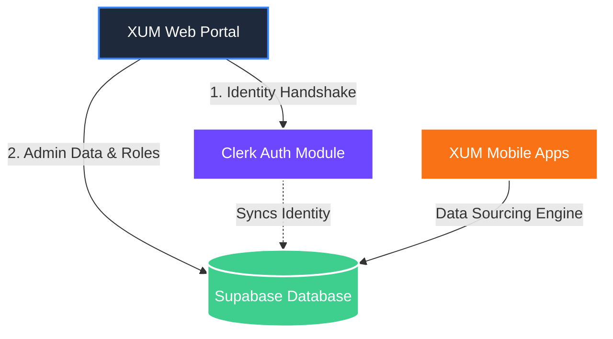

<div align="center">
  

  # 🌐 XUM AI: Global Intelligence Platform

  **Powering the next generation of LLMs and Vision Models with verified, culturally diverse human intelligence.**

  [](https://reactjs.org/)
  [](https://www.typescriptlang.org/)
  [](https://vitejs.dev/)
  [](https://tailwindcss.com/)
  [](https://supabase.com/)
  [](https://clerk.dev/)

</div>

---

## 🚀 Overview

The **XUM Portal** serves as the central landing hub and administrative bridge for the **XUM AI** ecosystem. It is designed to attract enterprise partners, onboard waitlist users, and provide secure access to the internal Admin Terminal.

> 💡 **Note for Enterprise Companies & Regular Trainers:**  
> The actual data collection, validation, and dashboard experiences live inside the **XUM AI Mobile Applications** (iOS/Android).

## ✨ Key Features

- **🎨 Premium Dark UI:** An immersive, glass-morphism dark mode aesthetic powered by TailwindCSS and Framer Motion.
- **🛡️ Secure Admin Terminal:** Integrated Clerk authentication tightly coupled with Supabase Role-Based Access Control (RBAC). Only authenticated users with the `admin` role can access the portal.
- **🏢 Enterprise Landing:** A highly converting business landing page showcasing the 5-source data model, global reach, and robust RLHF capabilities.
- **⚡ Performance First:** Built on Vite and React 19 for instantaneous hot-module replacement and lightning-fast load times.

---

## 🏗️ Architecture Stack

XUM AI applies a hybrid architecture to maximize security and scale:



### 1. The Gateway (`xum-portal`)
This repository! It handles marketing, waitlist conversions, and serves as the locked-down control room for internal staff (`/admin/dashboard`).

### 2. Identity (`Clerk`)
Handles magic links, passwords, and 2FA. Automatically synchronizes new profiles to the Supabase database.

### 3. The Source of Truth (`Supabase`)
PostgreSQL backend containing all trainer data, enterprise prompts, validation schemas, and administrative roles.

---

## 🛠️ Quickstart Guide

### Prerequisites
- Node.js (v20+)
- npm or yarn
- Clerk Publishable Key
- Supabase REST URL & Anon Key

### Installation

1. **Clone the repository:**
   ```bash
   git clone https://github.com/my-edutu/xum-portal.git
   cd xum-portal
   ```

2. **Install dependencies:**
   ```bash
   npm install
   ```

3. **Configure Environment Variables:**
   Create a `.env` file in the root directory:
   ```env
   VITE_CLERK_PUBLISHABLE_KEY=pk_test_...
   VITE_SUPABASE_URL=https://...supabase.co
   VITE_SUPABASE_ANON_KEY=eyJ...
   ```

4. **Start the Development Server:**
   ```bash
   npm run dev
   ```

---

## 🔐 Admin Authentication Flow

To access the `<AdminTerminal />`, the application enforces a rigorous check:

1. User clicks **"Admin"** in the footer and is routed to `/auth?intent=admin`.
2. User authenticates via **Clerk**.
3. `AdminContext` intercepts the login and queries the `users` table in **Supabase** via the user's email.
4. If `role === 'admin'` or email is in the Master Admin list (e.g., `info@xumai.app`, `infoafrichainx@gmail.com`), access is granted.
5. If unauthorized, the user is safely redirected back to the homepage (`/`).

---

<div align="center">
  <p>Built with 💙 by the XUM AI Engineering Team</p>
  <p><i>Global Intelligence, Human Verified.</i></p>
</div>
